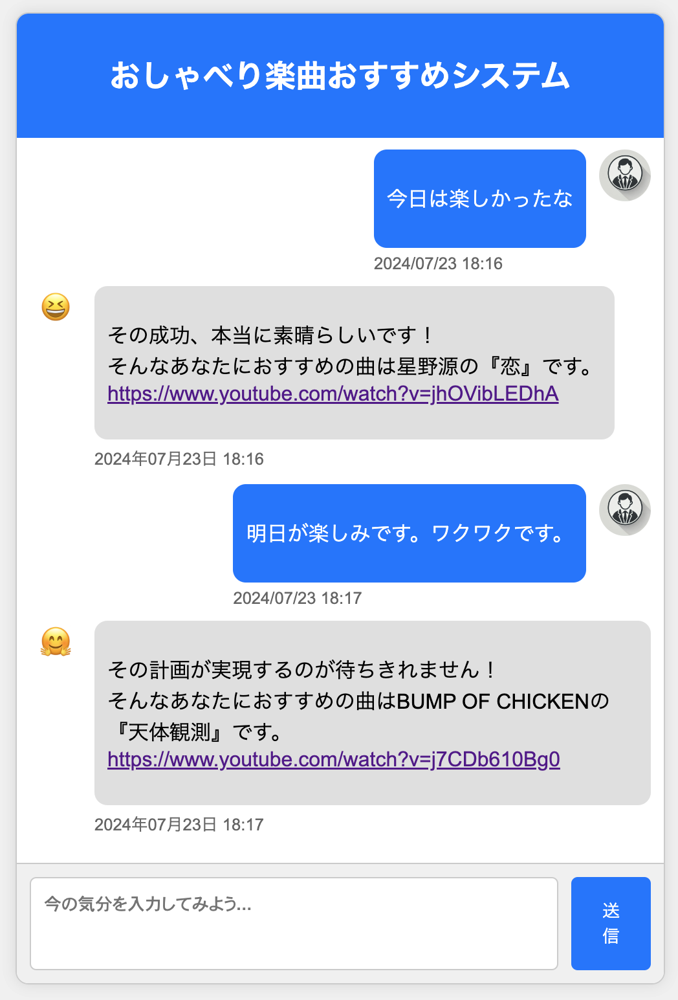

# 楽曲レコメンドチャット

## このアプリについて

以下の一連の流れを行うアプリになります。

つぶやきを投稿してもらう→その内容を感情解析する→感情に該当する楽曲の中からランダムに選択して、chat形式で回答する

## 工夫点

- bot側の顔画像は、判定された感情に応じて変化します。
- 送信時刻がチャットの下に記載されます。
- テキストのサイズに合わせて吹き出しの大きさは変化します。
- データがない場合もしくは欠損値がある場合はおすすめの曲はないと返答します。

## 技術スタック

- python 3.9以上

## はじめかた

### データの準備

- song_database.csvを用意してください。
- サンプルを載せています。

### 事前準備

- 仮想環境に入る
- `pip install -r requrements.txt`
- `python app.py`
- ブラウザにローカルホスト3000で入る

## イメージ

## 今後の課題

- chatbotの返答の種類が固定なので、LLMなどを介した会話にする
- 与えられた提案に対して、ユーザ側がフィードバックを与えられるようにする
- 楽曲データベースの自動生成・更新を行う
- などなど、、、

## 参考にさせていただいた記事

- 感情エンジン https://huggingface.co/Mizuiro-sakura/luke-japanese-large-sentiment-analysis-wrime
- chatbot のシステム https://qiita.com/Yu_unI1/items/53570f021363d9f57d4c
